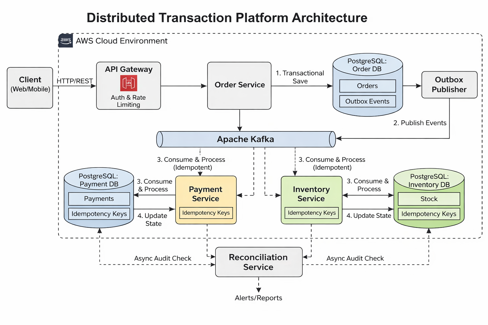

# Distributed Transaction Platform

## Overview

The **Distributed Transaction Platform** is a banking-grade backend system designed to demonstrate how financial orders and payments are processed reliably in a distributed, failure-prone environment.

The project focuses on **correctness, auditability, and operational safety** rather than feature velocity or UI concerns.  
It mirrors how large financial institutions design backend systems where **data integrity and recoverability are more important than convenience**.

This repository is intentionally structured and documented as if it were an internal enterprise system.

---

## Why This Project Exists

In financial systems:

- Requests can be duplicated
- Services can crash mid-transaction
- Messages can be delivered more than once
- Real-time processing can silently fail

This project is built around the assumption that **failures are inevitable**, and demonstrates how to design systems that remain **financially correct** under those conditions.

---

## Core Principles

This platform is built on the following principles:

- **Financial correctness over convenience**
- **Exactly-once logical execution for payments**
- **No dual writes between databases and message brokers**
- **Immutable, append-only financial ledger**
- **Event-driven communication**
- **Recoverability through retries and reconciliation**
- **Auditability as a first-class concern**

If a design choice conflicts with any of the above, it is rejected.

---

## High-Level Architecture

- Services communicate asynchronously using events
- Each service owns its own database
- Distributed workflows are coordinated using the **Saga Orchestration pattern**

---

## Key Capabilities

### Order Management
- Accepts and persists financial orders
- Uses time-sortable, non-sequential identifiers
- Emits order events safely using the **Transactional Outbox pattern**

### Payment Processing
- Processes payments with **idempotency guarantees**
- Prevents duplicate charges even under retries
- Records all monetary movements in an **immutable ledger**

### Distributed Transactions
- Uses Saga orchestration instead of two-phase commit
- Explicit compensating actions for failure scenarios
- Deterministic state transitions

### Failure Handling
- Safe recovery from service crashes
- Safe handling of duplicate messages
- Eventual consistency with operational safety nets

### Reconciliation
- Periodic reconciliation process verifies:
  - Orders vs payments
  - Payments vs ledger entries
- Flags discrepancies for investigation

---

## Technology Stack

### Backend
- Java 17
- Spring Boot
- Spring Data JPA
- Spring Kafka

### Data & Messaging
- PostgreSQL
- Apache Kafka

### Infrastructure & Ops
- Docker & Docker Compose
- AWS EC2 (deployment)
- AWS Secrets Manager (credentials)
- Structured logging with correlation IDs

### Testing
- JUnit 5
- Testcontainers (PostgreSQL, Kafka)

---

## What This Project Is *Not*

This project intentionally avoids:

- Frontend or UI development
- Real card processing or PCI-level compliance
- Multi-region deployment
- Ultra-low latency optimization
- Artificial feature expansion

The goal is **depth of correctness**, not breadth of features.

